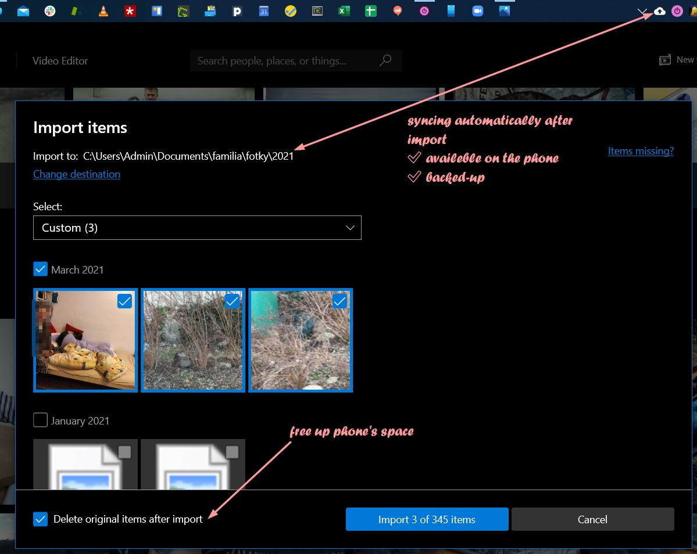

# kronCLI

This repo contains a PowerShell script for the creation of a cronicle/diary entry importing and compressing images from a given folder. I use it for the creation of a family chronicle. 

## instructions
* Connect the phone to the PC in the PTP transfer mode
* Windows Photo starts automatically (configured as such)
* Select all the photos to be imported
* Change destination to the destination of all annual photos
    - this destination is synced with Google Photos which archives all pictures

* Navigate to the master folder and delete redundant photos 
    - [Total Commander](https://www.ghisler.com/) for navigation
    - [IrfanView](https://www.irfanview.com/) for quick viewing / deletion
* Run the script and write about your yesterday
    - I set an alias as `k` in the `$profile`
    - You will get an empty day with selected images that are copied to the chronicle's repo folder
    - Save
    - Done

* Usually at on the first day of the month, navigate to the folder of the previous month, merge daily posts and create a `.pdf` and print it out to have a hardcopy of the chronicle, too
