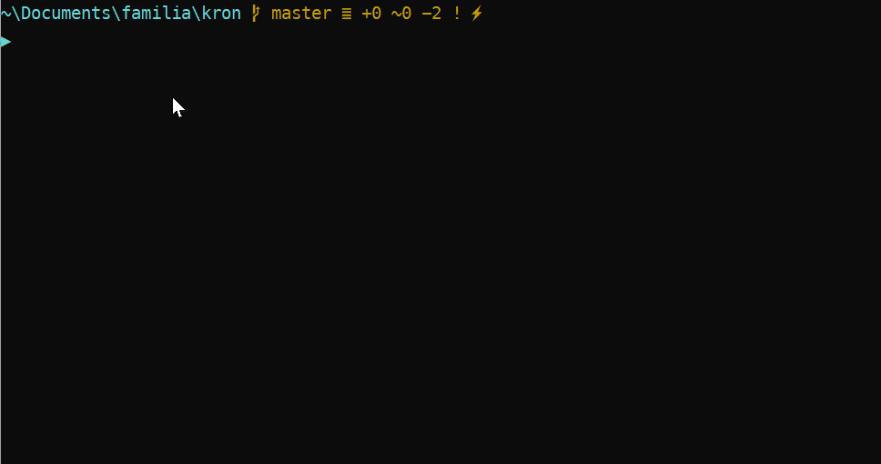
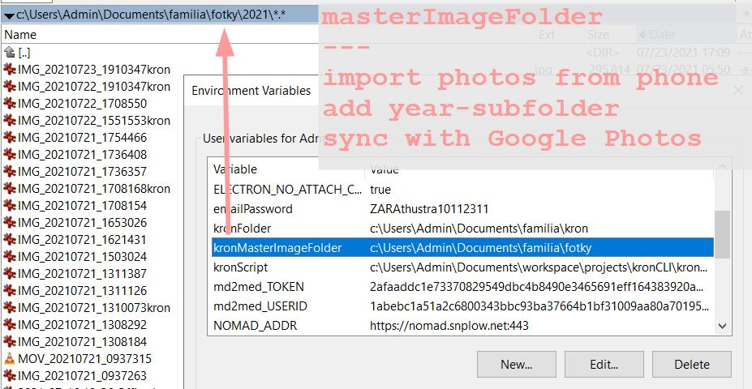

# kronCLI
[](https://forthebadge.com)


This repo contains a PowerShell script for the creation of a templated markdown-based journal entry for yesterday which imports and compresses images from a given folder. 

I use it as a morning ritual, for the creation of a family chronicle. 

### 1. demo
#### 1.1. Item Creation


#### WebUI (optional)

### 2. setup
#### 2.1. prereqs
* [ImageMagick][#1]
* [MikTex/Pandoc][#2]

#### 2.2. environmental variables
* you need the following environmental variables

Name                    | Example Value
------------------------|----------------------
`kronScript`            | `c:\kronCLI\kron.ps1`
`kronMasterImageFolder` | `c:\photos`
`kronFolder`            | `c:\journal`

#### 2.3. manual work
* Manually create an annual folder within `kronMasterImageFolder`
    - this is where you import your photos from the phone

```
c:\photos\2019
c:\photos\2020
c:\photos\2021
```

* You have to **hard code** the pattern catching the actual images for a selected timespan:
    - open https://github.com/pkutaj/kronCLI/blob/master/kron.ps1#L30-L34
    - based on your files, you need to properly define 2 variables: `$timeStampPattern` and `$photosPattern`
    - just navigate to your annual `kronMasterImageFolder` (e.g. `c:\photos\2021`) and run something like

```powershell
# c:\photos\2021

$timeStampPattern = "yyyyMMdd"          # put the value into script when done
$yesterdayPattern = ((Get-Date) - (New-TimeSpan -Days 1)).ToString($timeStampPattern) # IGNORE
$pattern = "IMG_$yesterdayPattern.*"    # put the value into script then done
(dir) -match $pattern | Select Name     # run interactive pattern-check 

# OUTPUT OF MATCHES
# -----------------
# IMG_20210716_1404144kron.jpg
# IMG_20210716_1416013kron.jpg
# IMG_20210716_1700289.jpg
# IMG_20210716_1700311.jpg
```

#### 2.4. profile

* You can set up an alias in PowerShell profile to call a script from anywhere
    - I set an alias as `k` in the `$profile` and just hit `k` to run it from anywhere
    
```powershell
$profile
Import-Module $env:kronScript
Set-Alias k new-kron
```

### 3. instructions
* Connect the phone to the PC in the PTP transfer mode
* Windows Photo starts automatically (if configured as such)
* Import your photos to the `kronMasterImageFolder`
    - I am syncing this with Google Photos at this point
    - I am also deleting photos from my phone



* Recommended: Navigate to the master folder and delete redundant photos 
    - [Total Commander](https://www.ghisler.com/) for navigation
    - [IrfanView](https://www.irfanview.com/) for quick viewing / deletion
* Run the script `. kron.ps1` (or any alias) and write about your yesterday
* The script then:
    1. Copies, renames, and compresses images from the `$env:kronMasterImageFolder`  
    2. The script puts them in `$env:kronFolder\assets`
    3. It populates the newly created markdown file with the image links in markdown format
* You can write about your day with photos already populated
* To merge all posts into `.pdf` to print out as a hard-copy:
    1. Navigate to the folder of the previous month
    2. Run `. kron.ps1 -merge` 

### 4. sharing
* I am storing and sharing my journal as a family chronicle as a private GitHub repo
* See [GitHub for Storage + UI][#3] for setting that up

[#1]: https://pavolkutaj.medium.com/convert-and-compress-images-from-the-command-line-with-imagemagick-9d08e6537255
[#2]: https://pavolkutaj.medium.com/markdown-to-pdf-with-pandoc-and-miktex-58b578cedf4b
[#3]: https://pavolkutaj.medium.com/redirect-to-a-github-repo-from-a-top-level-domain-db7ce8d3b80